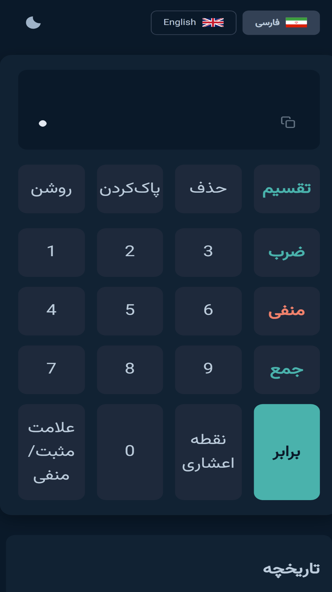
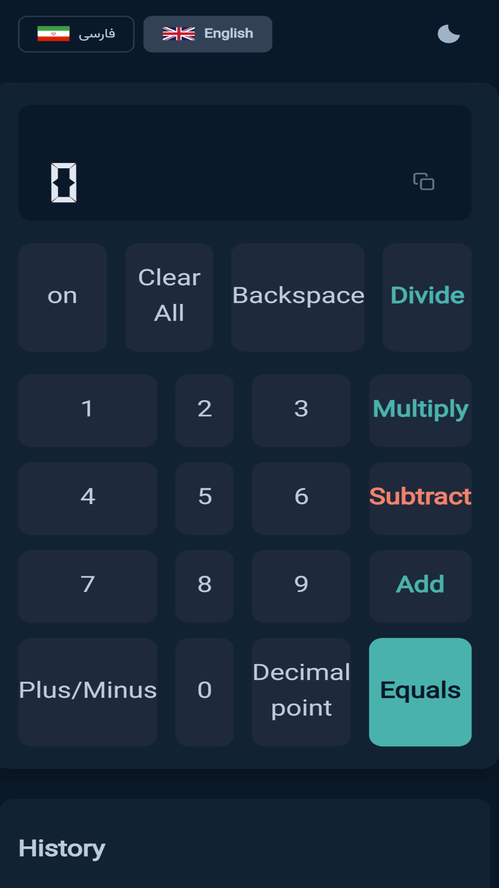

# ماشین حساب دو زبانه 🧮🌐  
Bilingual Calculator (FA/EN) Progressive Web App

---

## 📑 فهرست مطالب | Table of Contents
- [فارسی](#فارسی)
- [English](#english)

---

## فارسی

### 📖 معرفی
ماشین حساب دو زبانه یک وب‌اپلیکیشن پیشرفته (PWA) است که به دو زبان فارسی و انگلیسی ارائه می‌شود.  
این پروژه علاوه بر محاسبات پایه، قابلیت نصب روی موبایل و دسکتاپ، پشتیبانی از حالت آفلاین، و رابط کاربری واکنش‌گرا را فراهم می‌کند.

### ✨ ویژگی‌ها
- ➕ چهار عمل اصلی ریاضی (جمع، تفریق، ضرب، تقسیم)  
- 📝 تاریخچه محاسبات ذخیره‌شده در LocalStorage  
- 🌙 حالت تاریک و روشن (Dark/Light Mode)
- 🌍 پشتیبانی از دو زبان (فارسی و انگلیسی)  
- 📱 طراحی واکنش‌گرا (Responsive)  
- ⚡ نصب به‌عنوان PWA با آیکون اختصاصی  
- 🔋 قابلیت استفاده در حالت آفلاین (Service Worker)  
- 🧩 معماری ماژولار برای ماشین حساب (controller, math, dom, state, utils)  
- 📊 مدیریت تاریخچه محاسبات و گزارش‌ها  

### 📂 ساختار پروژه
```
.
├── index.html          # صفحه اصلی
├── 404.html            # صفحه خطا
├── pages/              # صفحات داخلی (history, report, offline)
├── assets/
│   ├── css/            # استایل‌ها
│   ├── js/             # اسکریپت‌ها
│   │   ├── calculator/ # ماژول ماشین‌حساب
│   │   └── shared/     # کدهای مشترک
│   ├── icons/          # آیکون‌ها
│   ├── images/         # تصاویر
│   ├── fonts/          # فونت‌ها
│   ├── i18n/           # فایل‌های زبان
│   └── screenshots/    # اسکرین‌شات‌ها
└── LICENSE             # مجوز
```

### 🚀 نصب و اجرا
1. مخزن را کلون کنید:
   ```bash
   git clone https://github.com/SeyyedHosseinShahrokhi/bilingual-calculator.git
   cd bilingual-calculator
   ```
2. فایل `index.html` را در مرورگر باز کنید.  
یا برای اجرای محلی به‌صورت PWA:
   ```bash
   npx serve .
   ```

### 🛠️ استفاده
- زبان موردنظر را انتخاب کنید (فارسی یا انگلیسی).  
- محاسبات خود را انجام دهید.  
- تاریخچه محاسبات در بخش History ذخیره می‌شود.  
- در حالت آفلاین هم قابل استفاده است.  

### 📸 پیش‌نمایش


### 🤝 مشارکت
1. مخزن را Fork کنید 🍴  
2. یک شاخه جدید بسازید (`git checkout -b feature/your-feature`)  
3. تغییرات خود را کامیت کنید (`git commit -m 'افزودن ویژگی جدید'`)  
4. پوش کنید (`git push origin feature/your-feature`)  
5. Pull Request باز کنید ✅  

### 📜 مجوز
این پروژه تحت مجوز [MIT](LICENSE) منتشر شده است.  

---

## English

### 📖 Introduction
**Bilingual Calculator** is a Progressive Web Application (PWA) that supports both Persian (FA) and English (EN).  
It provides basic and advanced calculations, offline functionality, responsive design, and the ability to be installed on mobile and desktop devices.

### ✨ Features
- ➕ Basic arithmetic operations (addition, subtraction, multiplication, division)  
- 📝 Calculation history stored in LocalStorage  
- 🌙 Dark/Light mode toggle
- 🌍 Dual language support (Persian and English)  
- 📱 Responsive design for mobile and desktop  
- ⚡ Installable as a PWA with custom icons  
- 🔋 Offline usage powered by Service Worker  
- 🧩 Modular architecture for calculator logic (controller, math, dom, state, utils)  
- 📊 History management and reporting  

### 📂 Project Structure
```
.
├── index.html          # Main entry point
├── 404.html            # Error page
├── pages/              # Internal pages (history, report, offline)
├── assets/
│   ├── css/            # Stylesheets
│   ├── js/             # JavaScript files
│   │   ├── calculator/ # Calculator modules
│   │   └── shared/     # Shared utilities
│   ├── icons/          # App icons
│   ├── images/         # Images
│   ├── fonts/          # Fonts
│   ├── i18n/           # Language files
│   └── screenshots/    # Screenshots
└── LICENSE             # License file
```

### 🚀 Installation & Run
1. Clone the repository:
   ```bash
   git clone https://github.com/SeyyedHosseinShahrokhi/bilingual-calculator.git
   cd bilingual-calculator
   ```
2. Open `index.html` in your browser.  
Or run locally as a PWA:
   ```bash
   npx serve .
   ```

### 🛠️ Usage
- Select your preferred language (Persian or English).  
- Perform calculations directly in the app.  
- Access the **History** section to review past calculations.  
- Use the app even when offline.  

### 📸 Screenshots


### 🤝 Contributing
1. Fork the repository 🍴  
2. Create a new branch (`git checkout -b feature/your-feature`)  
3. Commit your changes (`git commit -m 'Add new feature'`)  
4. Push to your branch (`git push origin feature/your-feature`)  
5. Open a Pull Request ✅  

### 📜 License
This project is licensed under the [MIT License](LICENSE).  
You are free to use, modify, and distribute it.  
